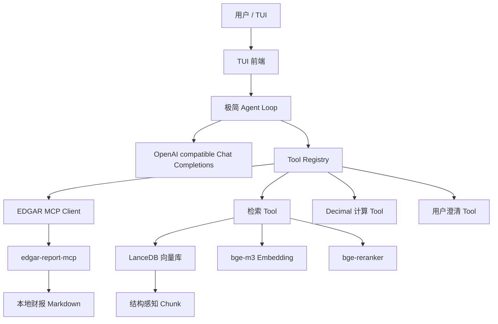

# 美股财报分析问答 Agent 开发文档

本文档根据项目根目录的 `CODEX.md` 编写，用来指导后续开发、记录总体架构和阶段索引。每个开发阶段结束后，都要单独编写一份阶段文档，详细解释该阶段“做了什么、怎么实现、为什么这样做”。

项目目标是构建一个以美股 10-K/10-Q 财报为数据源的财报分析问答 Agent。系统使用 Agentic RAG：检索不是隐藏在回答流程里的固定步骤，而是作为 tool 暴露给 Agent Loop，让模型在需要查证财报原文时主动调用。项目要求代码极简、中文注释充分，并原生支持多轮对话、流式输出和 TUI 前端。

## 1. 文档维护规则

本项目是教学性质项目，因此开发文档本身也是交付物。`docs/DEVELOPMENT.md` 只维护总体设计、阶段计划和阶段文档索引；每完成一个开发阶段，都要在 `docs/stages/` 下单独创建一份阶段文档。

阶段文档命名规则：

```text
docs/stages/phase-00-mcp-baseline.md
docs/stages/phase-01-agent-loop.md
docs/stages/phase-02-mcp-integration.md
```

每份阶段文档都必须包含：

1. 做了什么：列出新增模块、文件、功能和用户可见行为。
2. 怎么实现：解释核心数据流、函数边界、关键伪代码或接口。
3. 做了什么决定：记录取舍，例如为什么选择某个库、为什么保留某种极简结构。
4. 为什么这样决定：说明原因，尤其是教学性、可维护性、最小复杂度和可验证性。
5. 如何验证：记录手动验证命令、自动化测试和评测结果。

每个阶段结束后都要更新：

- `docs/stages/phase-XX-*.md` 中对应阶段的独立开发文档。
- 本文档的阶段文档索引，只记录链接、状态和一句话摘要。
- `README.md` 中面向使用者的简要说明。
- 相关模块中的中文注释，确保每个方法都能解释自己的存在理由。

## 2. 当前项目基线

初始目录只提供了一个 MCP server：

```text
mcp/edgar-mcp-server/
  README.md
  pyproject.toml
  src/edgar_mcp_server/
    server.py
    company_aliases_zh.json
  tests/
    test_server_helpers.py
```

这个 MCP server 的职责非常清楚：输入公司名、年份和 10-K/10-Q 类型，解析 SEC 公司，下载对应财报，转换为 markdown，做轻量清洗，并把清洗后的 markdown 保存到本地文件。

已经存在的 MCP tools：

- `resolve_company_name`：把英文公司名、中文公司名、ticker 或 CIK 解析成 SEC 公司。
- `download_10k_10q_markdown`：下载并清洗指定年份的 10-K/10-Q，返回公司信息、财报元数据、输出路径和预览内容。

重要环境变量：

- `API_KEY`：OpenAI compatible chat completions API key。
- `BASE_URL`：OpenAI compatible chat completions API base URL。
- `MODEL`：默认聊天模型名称。
- `EDGAR_IDENTITY`：SEC 请求身份标识，MCP server 下载财报时必须设置。
- `EDGAR_MCP_OUTPUT_DIR`：可选，指定财报 markdown 输出目录。
- `EDGAR_COMPANY_ALIASES_JSON`：可选，扩展中文公司名到 ticker/CIK 的映射。

现有 MCP server 的设计边界：

- 它负责“取得干净财报原文”，不负责向量索引。
- 它返回文件路径和元数据，不把大段财报原文塞进工具响应。
- 它内置常见中文公司别名，适合中文用户自然提问。
- 它不处理 20-F/6-K，若外国发行人没有 10-K/10-Q，需要给用户明确解释。

## 3. 产品目标

用户应该可以在 TUI 中像这样自然提问：

```text
用户：苹果 2023 年 10-K 里服务业务收入是多少？
Agent：调用检索 tool 查询 Apple 2023 10-K 的 revenue / services 信息，然后基于原文回答并给出来源。

用户：和微软同年相比谁的毛利率更高？
Agent：理解“同年”指上一轮的 2023 年，检索微软财报，必要时调用计算 tool，用 Decimal 计算毛利率并比较。

用户：帮我看英伟达最近一份 10-Q 的库存变化。
Agent：若年份不明确，先调用澄清 tool 问用户要年份或允许使用最近可用年份；得到确认后再下载/检索。
```

系统必须支持：

- 多轮对话：后续问题可以引用上一轮的公司、年份、财报类型和指标。
- 工具调用：Agent 可以调用 MCP、检索、计算、澄清等工具。
- Agentic RAG：检索必须是 tool，而不是硬编码在每轮回答之前。
- 流式输出：模型回答时在 TUI 中逐步显示。
- 精确计算：金融计算使用 `Decimal`，避免二进制浮点误差。
- 可追溯回答：财报事实必须尽量附带来源 chunk 和财报元数据。
- 评测闭环：自建 30 条模拟用户交互评测集，覆盖事实、计算、澄清、多轮和多公司场景。

非目标：

- 第一版不做 Web UI。
- 第一版不做复杂权限系统。
- 第一版不追求覆盖所有 SEC 表单，只围绕 10-K/10-Q。
- 第一版不做数据库服务化部署，LanceDB 使用本地文件目录。

## 4. 总体架构



核心数据流：

1. 用户在 TUI 输入问题。
2. TUI 把用户消息追加到会话历史，并启动 Agent Loop。
3. Agent Loop 调用 chat completions API。
4. 如果模型返回普通文本，TUI 流式显示。
5. 如果模型返回 tool call，Agent Loop 查找 Tool Registry 并执行工具。
6. 工具结果以 `tool` 消息追加回会话历史。
7. Agent Loop 继续请求模型，直到模型给出最终回答或达到最大工具轮数。

为什么采用这个架构：

- 教学清晰：每个模块职责单一，读者能顺着消息流理解 Agent。
- 极简：没有引入工作流引擎或多 Agent 框架。
- 可替换：LLM、MCP、检索库和 TUI 都在边界层，后续可以局部替换。
- 可测：Agent Loop、tool、chunker、reranker 和 eval 都可以单独测试。

## 5. 计划目录结构

后续主项目建议采用下面结构：

```text
fin_report_agent/
  __init__.py
  main.py                  # 程序入口：读取配置，启动 TUI
  config.py                # 读取 .env 和环境变量
  llm.py                   # OpenAI compatible chat completions 客户端
  messages.py              # 会话消息结构和辅助函数

  agent/
    loop.py                # 极简 Agent Loop
    tool_registry.py       # tool 注册、schema 转换和调用分发
    prompts.py             # system prompt 和 tool 使用约束

  mcp_client/
    edgar.py               # 连接并调用 edgar-report-mcp

  retrieval/
    ingest.py              # 从 markdown 构建索引
    metadata.py            # 财报元数据解析和标准化
    chunker.py             # 结构感知切块
    contextual.py          # 规则生成 chunk 描述
    embeddings.py          # bge-m3 embedding 封装
    store.py               # LanceDB 表读写
    rerank.py              # bge-reranker 封装
    search.py              # 元数据过滤 + 向量召回 + rerank

  tools/
    edgar_tools.py         # MCP 下载/解析 tool 的 Agent 包装
    retrieval_tool.py      # Agentic RAG 检索 tool
    calculator_tool.py     # Decimal REPL 计算 tool
    clarify_tool.py        # 请求用户澄清 tool

  tui/
    app.py                 # TUI 主循环
    render.py              # 流式文本、tool 调用状态和来源渲染

  eval/
    dataset.py             # 读取 30 条评测样本
    runner.py              # 自动跑评测
    metrics.py             # 指标计算
    judge.py               # 可选 LLM judge

data/
  filings/                 # MCP 下载的 markdown
  lancedb/                 # 本地 LanceDB 向量库
  eval/                    # 评测集和评测输出

docs/
  DEVELOPMENT.md           # 本文档
  stages/                  # 每个阶段结束后的独立开发文档
    phase-00-mcp-baseline.md
    phase-01-agent-loop.md
```

目录决策：

- 主代码放在 `fin_report_agent/`，避免和 `mcp/edgar-mcp-server/` 混在一起。
- `mcp/` 保留为外部数据获取能力，不把主 Agent 逻辑写进去。
- `tools/` 存放 Agent 可见的工具包装，`retrieval/` 存放检索内部实现。
- `eval/` 与业务代码同包，便于复用工具和配置。
- `data/` 存放生成数据，不应该提交大体积财报和向量库。

## 6. 配置与环境

项目使用 `uv` 和 `venv` 管理环境。

推荐初始化命令：

```bash
uv venv
source .venv/bin/activate
uv pip install -e mcp/edgar-mcp-server
```

后续添加主项目依赖后，统一通过 `pyproject.toml` 管理：

```bash
uv pip install -e ".[dev]"
```

`.env` 只保存本地密钥，不在文档中记录密钥值。配置读取规则：

1. 先读取 `.env`。
2. 再读取真实环境变量。
3. 真实环境变量覆盖 `.env`。
4. 缺少必要项时启动失败，并给出中文错误信息。

计划配置项：

| 名称 | 必填 | 用途 |
| --- | --- | --- |
| `API_KEY` | 是 | Chat completions API key |
| `BASE_URL` | 是 | OpenAI compatible API 地址 |
| `MODEL` | 是 | 默认聊天模型 |
| `EDGAR_IDENTITY` | 下载财报时必填 | SEC 请求身份标识 |
| `EDGAR_MCP_OUTPUT_DIR` | 否 | 财报 markdown 输出目录 |
| `FIN_AGENT_DATA_DIR` | 否 | 主项目数据目录，默认 `data/` |
| `FIN_AGENT_LANCEDB_DIR` | 否 | LanceDB 目录，默认 `data/lancedb/` |
| `FIN_AGENT_MAX_TOOL_ROUNDS` | 否 | 单轮最多工具调用轮数，默认 8 |

## 7. Agent Loop 设计

Agent Loop 是项目第一阶段的核心。它只做五件事：

1. 保存多轮消息历史。
2. 把可用 tools 转成 chat completions 可识别的 schema。
3. 调用模型并流式接收输出。
4. 执行模型请求的 tool call。
5. 把 tool 结果追加回消息历史并继续循环。

极简伪代码：

```python
async def run_turn(user_text: str) -> None:
    messages.append({"role": "user", "content": user_text})

    for _ in range(max_tool_rounds):
        stream = llm.chat_stream(messages=messages, tools=tool_schemas)
        assistant_message = await collect_stream(stream)
        messages.append(assistant_message)

        if not assistant_message.tool_calls:
            return

        for tool_call in assistant_message.tool_calls:
            result = await tool_registry.call(tool_call.name, tool_call.arguments)
            messages.append(
                {
                    "role": "tool",
                    "tool_call_id": tool_call.id,
                    "name": tool_call.name,
                    "content": json.dumps(result, ensure_ascii=False),
                }
            )

    messages.append(
        {
            "role": "assistant",
            "content": "工具调用轮数已达到上限，请缩小问题范围后重试。",
        }
    )
```

关键实现决定：

- 不使用 LangChain、LlamaIndex 或工作流框架。原因是本项目强调教学性，需要让读者看到 Agent Loop 的完整控制流。
- Tool Registry 只负责 schema 和函数映射，不做业务判断。业务判断交给模型和具体 tool。
- 每轮设置最大工具轮数。原因是模型可能因为检索不足或澄清不充分陷入循环，必须有硬上限。
- 会话历史保存在内存中。第一版不做持久化，减少复杂度。
- 流式输出只渲染自然语言 token；tool call 的 JSON 增量在内部收集，TUI 只显示“正在调用某工具”的状态。

Agent system prompt 要强调：

- 财报事实必须先检索，不要凭记忆回答。
- 对缺失的公司、年份、表单类型要调用澄清 tool。
- 计算必须调用 Decimal 计算 tool，不要心算关键财务比例。
- 回答必须区分“原文事实”“计算结果”和“模型分析”。
- 不确定时要说明不确定，不编造财报数字。

## 8. LLM 客户端

LLM 客户端对接 OpenAI compatible chat completions API。接口只暴露两个方法：

- `chat(...)`：非流式，用于评测或简单调用。
- `chat_stream(...)`：流式，用于 TUI 交互。

请求字段保持最小集合：

```json
{
  "model": "$MODEL",
  "messages": [],
  "tools": [],
  "tool_choice": "auto",
  "stream": true
}
```

实现注意点：

- 兼容 `choices[0].delta.content` 的流式文本。
- 兼容 `choices[0].delta.tool_calls` 的增量 tool call。
- tool arguments 必须在完整收集后再 `json.loads`。
- API 错误要转换成中文错误，并保留原始状态码或错误类型，方便排查。

为什么单独封装 LLM：

- 主 Agent 不依赖具体 SDK。
- 后续可以替换不同 OpenAI-compatible provider。
- 单元测试可以用 fake LLM 模拟 tool call。

## 9. MCP 集成

`edgar-report-mcp` 是数据获取层。主项目通过 MCP client 调用它，而不是直接 import 它的内部函数。

主项目需要包装两个 Agent tools：

### 9.1 公司解析 tool

用途：

- 当用户输入中文公司名、英文公司名、ticker 或 CIK 时，解析成标准公司信息。
- 当公司名称可能歧义时，返回候选项，必要时让 Agent 调用澄清 tool。

建议 schema：

```json
{
  "name": "resolve_company",
  "description": "解析美股公司名称、ticker 或 CIK。用户给中文公司名时也可以调用。",
  "parameters": {
    "type": "object",
    "properties": {
      "company_name": {"type": "string"},
      "limit": {"type": "integer", "default": 10}
    },
    "required": ["company_name"]
  }
}
```

### 9.2 财报下载 tool

用途：

- 按公司、年份和表单类型下载清洗后的 markdown。
- 返回本地路径，为后续索引提供输入。

建议 schema：

```json
{
  "name": "download_filing_markdown",
  "description": "下载指定公司、年份、10-K/10-Q 类型的 SEC 财报 markdown。仅在本地缺少该财报时调用。",
  "parameters": {
    "type": "object",
    "properties": {
      "company_name": {"type": "string"},
      "year": {"type": "integer"},
      "form_type": {"type": "string", "enum": ["10-K", "10-Q", "both"]},
      "max_filings": {"type": "integer"}
    },
    "required": ["company_name", "year", "form_type"]
  }
}
```

关键实现决定：

- MCP tool 的原始响应通常较长，Agent tool 包装层要保留关键字段，避免把过多预览文本放入上下文。
- 下载成功后不自动回答用户问题，而是提示 Agent 下一步调用检索 tool 或索引构建逻辑。
- 对 “没有 10-K/10-Q” 的情况要原样传递建议，尤其是 foreign private issuer 的 20-F/6-K 提示。

## 10. 检索系统设计

检索阶段由五步组成：

1. 读取 MCP 生成的 markdown。
2. 解析 metadata header。
3. 做结构感知切块。
4. 给每个 chunk 添加规则生成的 contextual description。
5. 写入 LanceDB，并在查询时先 metadata filter，再向量召回，最后 rerank。

### 10.1 Markdown 元数据解析

MCP server 生成的 markdown 顶部包含表格元数据，例如：

```markdown
# Apple Inc. 10-K Markdown

| Field | Value |
| --- | --- |
| Requested company | 苹果 |
| Resolved company | Apple Inc. |
| Ticker | AAPL |
| CIK | 320193 |
| Requested year | 2023 |
| Form | 10-K |
| Filed date | 2023-11-03 |
| Report period | 2023-09-30 |
| Accession number | ... |
```

主项目需要把这些字段标准化成：

```python
FilingMetadata(
    company_name="Apple Inc.",
    ticker="AAPL",
    cik="320193",
    requested_year=2023,
    form="10-K",
    filed_date="2023-11-03",
    report_period="2023-09-30",
    accession_number="...",
    source_path="..."
)
```

为什么先标准化元数据：

- 检索前必须先按元数据过滤。
- 多公司、多年份、多表单问题依赖元数据过滤避免误召回。
- 评测时可以检查来源是否来自正确财报。

### 10.2 结构感知切块

普通固定长度切块会打断 SEC 财报的重要结构，例如 Item 7、Item 8、表格和风险因素段落。因此第一版 chunker 要识别以下结构：

- Markdown 标题：`#`、`##`、`###`。
- SEC item 标题：`Item 1`、`Item 1A`、`Item 7`、`Item 7A`、`Item 8` 等。
- 表格块：连续的 markdown table 行。
- 页面标记：`<!-- page 3 -->`，作为辅助定位信息。

切块策略：

- 先按结构标题切出 section。
- section 太长时再按段落切分。
- 表格块尽量整体保留，不从中间切断。
- chunk 目标长度控制在约 800 到 1200 tokens。
- chunk overlap 控制在约 100 到 150 tokens，仅用于长段落续接。
- 每个 chunk 保存 heading path，例如 `Item 7 > Management's Discussion and Analysis > Results of Operations`。

Chunk 数据结构：

```python
DocumentChunk(
    chunk_id="AAPL-2023-10K-0001",
    text="...",
    context_text="...",
    indexed_text="[Chunk context] ...\n\n...",
    metadata=FilingMetadata(...),
    section_path=["Item 7", "Results of Operations"],
    page_start=12,
    page_end=14,
    token_count=942
)
```

为什么这样切：

- 财报问答通常围绕特定 item、表格或经营段落。
- 结构路径能帮助模型理解 chunk 在整份财报中的位置。
- 保留表格完整性有利于后续精确回答和计算。

### 10.3 Contextual Retrieval

Anthropic 提出的 Contextual Retrieval 思路是：在每个 chunk 前添加描述，使 chunk 即使脱离原文上下文也能被正确理解。本项目为了保持极简和可复现，第一版不调用 LLM 生成 chunk 描述，而是使用规则生成。

规则生成格式：

```text
[Chunk context]
Company: Apple Inc. (AAPL)
Filing: 2023 10-K, filed 2023-11-03, report period 2023-09-30
Section: Item 7 > Management's Discussion and Analysis
Content type: table and narrative text
This chunk discusses results of operations and revenue trends.
```

`indexed_text` 由 `context_text + "\n\n" + chunk.text` 组成，用于 embedding 和 rerank。返回给模型时也保留 context，但要明显区分 context 与原文。

为什么采用规则描述：

- 避免为每个 chunk 调 LLM，降低成本和不确定性。
- 规则可测试，适合教学项目。
- SEC 财报结构稳定，元数据和标题已经能提供大量上下文。

后续可选增强：

- 添加 LLM 生成描述作为第二版能力。
- 对表格 chunk 生成列名摘要。
- 对长 section 生成 section-level 摘要并存入 metadata。

### 10.4 LanceDB 表设计

LanceDB 表名建议为 `filing_chunks`。

字段建议：

| 字段 | 类型 | 说明 |
| --- | --- | --- |
| `chunk_id` | string | 稳定 chunk id |
| `text` | string | 原文 chunk |
| `context_text` | string | 规则生成 chunk 描述 |
| `indexed_text` | string | 用于 embedding 的完整文本 |
| `vector` | float vector | bge-m3 embedding |
| `company_name` | string | 公司名 |
| `ticker` | string | ticker |
| `cik` | string | CIK |
| `requested_year` | int | 用户请求年份 |
| `form` | string | 10-K / 10-Q |
| `filed_date` | string | 披露日期 |
| `report_period` | string | 报告期 |
| `accession_number` | string | SEC accession |
| `section_path` | list[string] | 标题路径 |
| `page_start` | int | 起始页，可能为空 |
| `page_end` | int | 结束页，可能为空 |
| `source_path` | string | markdown 文件路径 |

索引写入规则：

- 同一个 `source_path + accession_number` 已存在时默认跳过。
- 若 markdown 文件变化，使用文件 hash 判断是否需要重建。
- 重建时先删除该财报旧 chunks，再写入新 chunks。

### 10.5 Embedding

项目要求本机 Hugging Face 缓存里已有 `bge-m3`。实现时必须优先本地缓存：

```python
SentenceTransformer("BAAI/bge-m3", local_files_only=True)
```

注意事项：

- embedding 文本使用 `indexed_text`。
- 向量建议 normalize，便于 cosine 相似度。
- 批量写入，避免逐条 embedding 太慢。
- 如果本地模型缺失，报中文错误，不自动联网下载。

### 10.6 Reranker

项目要求本机 Hugging Face 缓存里已有 `bge-reranker`。查询流程：

1. 根据 query 和 metadata filter 从 LanceDB 召回 top 30。
2. 使用 reranker 对 `(query, indexed_text)` 打分。
3. 返回 top 5 到 top 8 给 Agent。

为什么加 rerank：

- 财报 chunk 很多，单纯向量召回容易把相似但不精确的段落排在前面。
- reranker 对具体问题和候选 chunk 的匹配判断更强。
- top 5 到 top 8 能控制上下文长度，减少模型迷失。

## 11. 检索 Tool 设计

检索 tool 是 Agentic RAG 的关键。它必须告诉模型：调用前要改写查询，把用户口语问题转成适合财报检索的英文或中英混合查询。

建议 tool description：

```text
Search indexed 10-K/10-Q filing chunks. Before calling this tool, rewrite the user's question
into a focused financial filing search query. Include normalized company, fiscal year, form type,
financial metric names, and likely SEC section names when known. Use metadata filters whenever
the company, ticker, year, or form is known. Do not use this tool for arithmetic; use the
calculator tool after retrieving numeric facts.
```

建议 schema：

```json
{
  "name": "search_filings",
  "description": "...",
  "parameters": {
    "type": "object",
    "properties": {
      "query": {
        "type": "string",
        "description": "改写后的检索查询，尽量包含英文财务术语和相关 SEC section"
      },
      "companies": {
        "type": "array",
        "items": {"type": "string"},
        "description": "公司名、ticker 或 CIK"
      },
      "years": {
        "type": "array",
        "items": {"type": "integer"}
      },
      "forms": {
        "type": "array",
        "items": {"type": "string", "enum": ["10-K", "10-Q"]}
      },
      "top_k": {
        "type": "integer",
        "default": 6
      }
    },
    "required": ["query"]
  }
}
```

返回格式：

```json
{
  "query": "...",
  "filters": {"ticker": ["AAPL"], "requested_year": [2023], "form": ["10-K"]},
  "results": [
    {
      "chunk_id": "AAPL-2023-10K-0042",
      "score": 0.91,
      "company_name": "Apple Inc.",
      "ticker": "AAPL",
      "form": "10-K",
      "requested_year": 2023,
      "filed_date": "2023-11-03",
      "section_path": ["Item 7", "Results of Operations"],
      "source_path": "data/filings/AAPL_2023_10-K.md",
      "text": "..."
    }
  ]
}
```

实现决定：

- 先 metadata filter，再 vector search。原因是用户常问明确公司和年份，先过滤能显著降低误召回。
- tool 输出包含 chunk 原文，但限制每个 chunk 的最大字符数，避免撑爆上下文。
- 结果必须包含来源字段，方便最终回答引用。
- 如果没有命中，应返回空结果和建议，不要假装找到了答案。

## 12. Decimal 计算 Tool

金融问答中的比例、同比、差额和单位换算必须精确。计算 tool 在 session 中维护一个安全 REPL 环境，但不执行任意 Python。

支持能力：

- Decimal 数字字面量。
- 基础运算符：`+`、`-`、`*`、`/`、`**`、括号。
- 一元正负号。
- 变量赋值：`revenue_2023 = 383285`。
- 变量引用：`revenue_2023 - revenue_2022`。
- 简单内置函数：`abs()`、`min()`、`max()`、`round()`。

不支持能力：

- import。
- 属性访问。
- 下标访问。
- 文件、网络、系统调用。
- 任意 Python 函数调用。
- float 字面量直接进入计算。所有数字都先转成字符串，再转成 `Decimal`。

建议 schema：

```json
{
  "name": "calculate_decimal",
  "description": "在当前会话的 Decimal 金融计算环境中执行表达式。用于比例、同比、差额、单位换算等精确计算。",
  "parameters": {
    "type": "object",
    "properties": {
      "code": {
        "type": "string",
        "description": "一行或多行 Decimal 表达式或变量赋值"
      }
    },
    "required": ["code"]
  }
}
```

示例：

```text
gross_margin = gross_profit / net_sales
gross_margin * 100
```

返回：

```json
{
  "success": true,
  "result": "44.13",
  "variables": {
    "gross_margin": "0.4413"
  }
}
```

实现决定：

- 使用 `ast` 做白名单解释器，而不是 `eval`。
- 每个 TUI 会话一个计算环境，方便多轮复用变量。
- tool 返回 Decimal 字符串，最终显示时由模型决定百分比、百万/十亿单位等表达。
- 模型必须先通过检索获取数字来源，再调用计算 tool；不能凭空输入数字。

## 13. 用户澄清 Tool

当问题缺少关键信息时，Agent 不应该猜测，而应该调用澄清 tool。典型场景：

- 公司不明确：例如“苹果还是 Apple Hospitality？”
- 年份不明确：例如“最近一年”但本地没有索引。
- 表单类型不明确：10-K 和 10-Q 都可能回答。
- 用户要求比较，但只给了一个公司。
- 计算所需指标缺失，可能需要用户选择口径。

建议 schema：

```json
{
  "name": "ask_user_clarification",
  "description": "当回答财报问题缺少必要公司、年份、表单或计算口径时，向用户提出一个简短澄清问题。",
  "parameters": {
    "type": "object",
    "properties": {
      "question": {"type": "string"},
      "options": {
        "type": "array",
        "items": {"type": "string"}
      },
      "reason": {"type": "string"}
    },
    "required": ["question"]
  }
}
```

TUI 行为：

- 暂停当前 Agent Loop。
- 显示澄清问题和可选选项。
- 用户输入后，把答案作为 tool result 追加回消息历史。
- Agent Loop 继续执行。

实现决定：

- 澄清是 tool，不是普通 assistant 文本。原因是这样 Agent Loop 可以用统一机制处理中断和恢复。
- 每次澄清只问一个问题。原因是 TUI 中多问题会增加用户负担。
- 澄清问题必须短，选项必须可直接选择。

## 14. TUI 前端设计

TUI 第一版选择轻量实现，推荐使用 `prompt_toolkit`。如果后续需要更复杂布局，再考虑 `textual`。

为什么优先 `prompt_toolkit`：

- 代码量更少，更符合极简教学目标。
- 天然适合“输入一段话 -> 流式输出一段回答”的聊天形态。
- 可以支持历史记录、多行输入、快捷键和异步刷新。

TUI 应显示：

- 用户输入。
- Agent 流式回答。
- tool 调用状态，例如：`正在检索 AAPL 2023 10-K ...`
- 澄清问题。
- 最终来源摘要。

TUI 不需要显示：

- 原始 tool call JSON。
- 大段检索 chunk 全文。
- API 密钥或底层请求详情。

第一版交互：

```text
FinReportAgent> 苹果 2023 年服务收入是多少？

Agent> 我先检索 Apple 2023 10-K 中 services revenue 相关段落。
[tool: search_filings]
Agent> Apple 2023 年服务净销售额为 ...
Sources:
  1. AAPL 2023 10-K, Item 7, filed 2023-11-03
```

## 15. 回答格式约定

最终回答要尽量简洁，但必须清楚区分事实、计算和分析。

推荐格式：

```text
结论：...

依据：...

计算：...

来源：AAPL 2023 10-K, Item 7, filed 2023-11-03
```

回答规则：

- 有数字就说明单位。
- 有计算就说明公式。
- 有多个来源时列出最关键的 1 到 3 个来源。
- 如果检索结果不足，要说“未在已索引财报中找到足够依据”。
- 不要把模型推断伪装成财报原文。

## 16. Evaluation 设计

项目要求自建 30 条模拟用户交互评测集。评测集要覆盖：

- 单轮事实问答。
- 多轮追问。
- 多公司比较。
- 年份或表单澄清。
- 需要计算的指标。
- 检索不到或没有 10-K/10-Q 的边界情况。

建议数据格式为 JSONL：

```json
{
  "id": "eval_001",
  "turns": [
    {"role": "user", "content": "苹果 2023 年服务收入是多少？"}
  ],
  "expected": {
    "companies": ["AAPL"],
    "years": [2023],
    "forms": ["10-K"],
    "must_call_tools": ["search_filings"],
    "may_call_tools": ["download_filing_markdown"],
    "answer_requirements": ["包含服务收入", "包含来源"]
  }
}
```

30 条评测建议分布：

| 类型 | 数量 | 示例 |
| --- | ---: | --- |
| 单公司事实 | 6 | 某年营收、分部收入、风险因素 |
| 多轮上下文 | 5 | 上轮说苹果，下轮问“那微软呢” |
| 多公司比较 | 5 | AAPL vs MSFT 毛利率 |
| Decimal 计算 | 6 | 同比、利润率、差额、占比 |
| 澄清问题 | 4 | 缺年份、缺公司、表单歧义 |
| 边界/失败 | 4 | 无 10-K/10-Q、未索引、问题超范围 |

核心指标：

- `tool_call_accuracy`：是否调用了必要 tool。
- `retrieval_filter_accuracy`：company/year/form metadata filter 是否正确。
- `retrieval_recall_at_k`：预期 section 是否出现在 top k。
- `answer_faithfulness`：回答数字和事实是否由检索结果支持。
- `calculation_accuracy`：Decimal 计算是否正确。
- `clarification_precision`：缺信息时是否问了正确澄清问题。
- `source_coverage`：最终回答是否给出来源。
- `turn_success_rate`：整条多轮任务是否完成。

评测实现决定：

- 第一版使用规则指标为主，LLM judge 为辅。
- 评测样本中尽量写明预期工具和元数据，不强行要求固定措辞。
- 对计算类问题保存期望公式，而不是只保存最终自然语言。
- 每次评测输出 markdown 报告和 JSON 结果，便于教学复盘。
- 真实评测必须只读取 EDGAR MCP 生成的清洗 markdown，并把 fixture 字符串匹配升级为真实模型 judge。

## 17. 分阶段实施计划

### 阶段 0：理解并固定 MCP 数据入口

状态：已提供初始 MCP server，待主项目接入。

做什么：

- 阅读 `mcp/edgar-mcp-server` 的 README、tool schema 和测试。
- 明确主 Agent 只通过 MCP 调用数据下载能力。
- 记录 MCP 输出 markdown 的 metadata header 作为后续索引输入契约。

为什么：

- 数据入口稳定后，Agent、检索和评测可以并行设计。
- 主项目不应该依赖 MCP server 内部 helper 函数，避免边界混乱。

验收：

- 能列出 MCP tools。
- 能用 `download_10k_10q_markdown` 下载一份 10-K/10-Q。
- 输出 markdown 顶部包含可解析 metadata。

### 阶段 1：极简 Agent Loop + LLM + Tool Registry

做什么：

- 新建主 Python package。
- 实现 `.env` 配置读取。
- 实现 OpenAI-compatible chat completions 客户端。
- 实现 Tool Registry。
- 实现支持多轮和 tool call 的 Agent Loop。
- 用 fake tool 写单元测试。

怎么实现：

- `messages` 是普通 list[dict]，保持接近 API 原始格式。
- `Tool` 是一个简单 dataclass：`name`、`description`、`parameters`、`callable`。
- Agent Loop 接收 `on_text_delta`、`on_tool_start`、`on_tool_result` 回调，供 TUI 渲染。

关键决定：

- 不引入大型 Agent 框架。
- 不做长期记忆和数据库会话。
- 工具调用采用模型原生 tool calling。

验收：

- 用户能连续问两轮问题，第二轮能看到上一轮上下文。
- fake LLM 返回 tool call 时，loop 能调用 fake tool 并继续生成最终答案。
- 流式文本能逐步回调给 TUI。

### 阶段 2：接入 MCP 并实现财报下载流程

做什么：

- 实现 MCP stdio client。
- 包装 `resolve_company_name` 和 `download_10k_10q_markdown` 为 Agent tools。
- 在 TUI 中显示下载进度和结果路径。

怎么实现：

- 启动 MCP subprocess，使用 stdio 传输。
- tool 包装层只返回必要字段：公司、ticker、CIK、filings、path、错误和建议。
- 下载后的 markdown 存入 `data/filings/` 或 `EDGAR_MCP_OUTPUT_DIR`。

关键决定：

- 通过 MCP 协议调用，不 import server.py。
- 下载 tool 不直接做 embedding，索引由 retrieval ingest 明确触发。

验收：

- 用户说“下载苹果 2023 年 10-K”，Agent 能调用 MCP 并返回本地 markdown 路径。
- 中文公司名可以解析。
- 未找到 10-K/10-Q 时能给出清楚解释。

### 阶段 3：结构感知索引与 Contextual Retrieval

做什么：

- 实现 markdown metadata parser。
- 实现结构感知 chunker。
- 实现规则 contextual description。
- 接入 bge-m3 embedding。
- 写入 LanceDB。

怎么实现：

- `ingest.py` 输入 markdown path，输出 chunk 数和 LanceDB 写入状态。
- `chunker.py` 先按 heading/item 切 section，再按 token 长度切 chunk。
- `contextual.py` 根据 metadata、section path、内容类型生成 chunk prefix。
- `store.py` 封装 LanceDB 表初始化、upsert 和过滤查询。

关键决定：

- 规则生成 chunk 描述，不调用 LLM。
- metadata 是检索过滤的第一层，不依赖模型事后筛选。
- 本地模型必须 `local_files_only=True`。

验收：

- 一份 10-K 能被切成结构合理的 chunks。
- LanceDB 中每个 chunk 都有 metadata 和 vector。
- 检索 Apple 2023 revenue 时，top 结果来自 AAPL 2023 10-K 的相关 section。

### 阶段 4：检索 Tool + Reranker

做什么：

- 实现 `search_filings` tool。
- 查询时先 metadata filter，再 bge-m3 向量召回，再 bge-reranker 重排。
- tool description 明确要求模型改写查询。

怎么实现：

- tool 输入允许 `companies`、`years`、`forms` 作为过滤条件。
- company 输入先做标准化，尽量映射到 ticker/CIK。
- 初召回 top 30，rerank 后返回 top 6。

关键决定：

- 检索 tool 输出短 chunk 和来源，不输出整份财报。
- 没有索引命中时返回可操作建议，例如先下载并索引财报。

验收：

- Agent 会在回答财报事实前主动调用检索 tool。
- 对明确公司和年份的问题，filter 正确。
- 返回结果包含来源，最终回答能引用来源。

### 阶段 5：Decimal 计算 Tool

做什么：

- 实现安全 Decimal REPL。
- 支持会话级变量。
- 把计算 tool 注册到 Agent。

怎么实现：

- 用 `ast.parse` 解析表达式。
- 白名单允许数字、变量、基础运算符和少量函数。
- 所有数字统一构造成 `Decimal(str(value))`。

关键决定：

- 不使用 Python `eval`。
- 计算环境按会话隔离。
- 计算结果返回字符串，避免 JSON float。

验收：

- 能计算毛利率、同比增速、差额和占比。
- 计算中间变量可在同一会话后续复用。
- 非法表达式被拒绝，并给出中文错误。

### 阶段 6：用户澄清 Tool 与 TUI 完整交互

做什么：

- 实现 `ask_user_clarification` tool。
- TUI 支持暂停 Agent Loop 并等待用户回答。
- 将澄清答案作为 tool result 返回给 Agent。

怎么实现：

- clarify tool 不直接读取 stdin，而是抛出一个结构化 pending clarification。
- TUI 捕获 pending clarification，渲染问题并收集用户输入。
- Agent Loop 恢复时把用户回答追加为 tool 消息。

关键决定：

- 澄清是工具调用，保持 Agent Loop 的一致性。
- 每次只问一个最关键问题。

验收：

- 用户说“帮我分析苹果的 10-K”，Agent 会问年份。
- 用户回答年份后，Agent 能继续下载、检索或回答。
- 多轮上下文不会因为澄清中断而丢失。

### 阶段 7：评测集和指标报告

做什么：

- 编写 30 条 JSONL 评测样本。
- 实现 eval runner。
- 实现规则指标和可选 LLM judge。
- 生成评测报告。

怎么实现：

- 每条样本包含 turns、expected tools、expected metadata filters、answer requirements。
- runner 使用同一个 Agent Loop，但替换 TUI 为自动输入输出。
- metrics 从 tool trace 和最终答案中计算指标。

关键决定：

- 先评测行为链路，再评测自然语言优美程度。
- 对财报数字类问题，优先检查来源和计算公式。

验收：

- 能一键运行 30 条评测。
- 输出整体成功率和分项指标。
- 至少覆盖多轮、澄清、多公司和计算场景。

## 18. 测试策略

单元测试：

- `config.py`：缺配置、环境变量覆盖、默认路径。
- `llm.py`：流式 chunk 解析、tool call 增量拼接。
- `agent/loop.py`：无 tool、单 tool、多 tool、工具轮数上限。
- `tool_registry.py`：schema 注册、未知 tool、参数解析错误。
- `mcp_client/edgar.py`：使用 fake MCP 响应测试包装逻辑。
- `retrieval/metadata.py`：metadata header 解析。
- `retrieval/chunker.py`：SEC item、表格、长段落切块。
- `retrieval/contextual.py`：chunk 描述生成。
- `tools/calculator_tool.py`：Decimal 运算、安全拒绝。
- `tools/clarify_tool.py`：pending clarification 流程。

集成测试：

- 下载一份小规模财报 markdown。
- 构建索引。
- 调用检索 tool。
- Agent 基于检索结果回答。

评测测试：

- 跑 30 条模拟交互。
- 保存 tool trace。
- 保存最终答案。
- 输出指标报告。

## 19. 代码风格与注释规范

项目要求代码极简，并且每行代码、每个方法都要有作用。执行标准：

- 每个模块顶部写中文说明：这个模块解决什么问题，不解决什么问题。
- 每个 public function 写中文 docstring：输入、输出、为什么存在。
- 复杂逻辑旁写简短中文注释，解释“为什么”，不要重复“做什么”。
- 函数保持短小，优先返回清晰数据结构。
- 不做过早抽象。只有当重复出现三次或边界清晰时才提取 helper。
- 不吞异常。捕获后转成用户可理解的中文错误，并保留调试信息。
- 不在日志、文档或评测输出中打印 API key。

示例注释风格：

```python
def normalize_ticker(value: str) -> str:
    """把用户输入的 ticker 统一成大写形式，便于 metadata filter 精确匹配。"""
    return value.strip().upper()
```

不推荐：

```python
# 把 value strip 后 upper
return value.strip().upper()
```

原因：这类注释只是重复代码，没有教学价值。

## 20. 数据与缓存策略

建议数据目录：

```text
data/
  filings/                 # markdown 财报
  lancedb/                 # LanceDB 向量数据
  eval/
    cases.jsonl            # 30 条评测样本
    runs/                  # 每次评测输出
```

数据规则：

- 财报 markdown 可本地缓存，避免重复请求 SEC。
- LanceDB 可重建，不作为唯一数据源。
- 大体积生成数据不提交。
- 如果需要提交小样本，只提交经过裁剪的教学样例。

## 21. 错误处理原则

常见错误和处理方式：

| 场景 | 处理 |
| --- | --- |
| 缺少 `API_KEY` | 启动时报中文错误，提示检查 `.env` |
| 缺少 `EDGAR_IDENTITY` | 下载 tool 返回错误，提示 SEC 身份要求 |
| 公司无法解析 | 返回候选建议或要求用户换 ticker/CIK |
| 没有 10-K/10-Q | 解释可能是 foreign private issuer，建议检查 20-F/6-K |
| 本地 embedding 模型不存在 | 报中文错误，不自动联网下载 |
| LanceDB 无索引 | 检索 tool 建议先下载并索引 |
| tool 参数 JSON 错误 | Agent Loop 把错误作为 tool result 返回，让模型修正 |
| 计算表达式非法 | calculator tool 拒绝执行，说明支持的语法 |

## 22. 安全与正确性约束

- 不把 `.env` 中的密钥写入日志或文档。
- 不执行模型生成的任意 Python。
- 不把未检索到的数字当作事实。
- 不把 SEC 原文外的推断写成来源事实。
- 不自动下载 Hugging Face 模型，避免环境不可控。
- 不绕过 MCP server 直接访问 edgartools，保持边界清晰。

## 23. 阶段文档索引

本节只作为阶段文档索引，不承载完整实施记录。每个阶段开发结束后，都要在 `docs/stages/` 下写独立文档，并在下表补充链接、状态和一句话摘要。

| 阶段 | 状态 | 独立文档 | 摘要 |
| --- | --- | --- | --- |
| 阶段 0：理解并固定 MCP 数据入口 | 已完成 | `docs/stages/phase-00-mcp-baseline.md` | 固定 EDGAR MCP server 的数据入口、输出契约和本地验证方式。 |
| 阶段 1：极简 Agent Loop + LLM + Tool Registry | 已完成 | `docs/stages/phase-01-agent-loop.md` | 实现多轮消息、流式输出、tool schema 和工具调用闭环。 |
| 阶段 2：接入 MCP 并实现财报下载流程 | 已完成 | `docs/stages/phase-02-mcp-integration.md` | 将 MCP 的公司解析和财报下载能力包装成 Agent tools。 |
| 阶段 3：结构感知索引与 Contextual Retrieval | 已完成 | `docs/stages/phase-03-contextual-retrieval.md` | 解析 markdown、结构切块、生成 chunk context 并写入 LanceDB。 |
| 阶段 4：检索 Tool + Reranker | 已完成 | `docs/stages/phase-04-retrieval-tool.md` | 实现 metadata filter、向量召回、rerank 和 Agentic RAG 检索 tool。 |
| 阶段 5：Decimal 计算 Tool | 已完成 | `docs/stages/phase-05-decimal-calculator.md` | 实现会话级 Decimal REPL 金融计算环境。 |
| 阶段 6：用户澄清 Tool 与 TUI 完整交互 | 已完成 | `docs/stages/phase-06-clarification-tui.md` | 实现澄清中断、用户输入恢复和完整 TUI 体验。 |
| 阶段 7：评测集和指标报告 | 已完成 | `docs/stages/phase-07-evaluation.md` | 构建 fixture 回归评测和真实 MCP 财报 + 真实模型复评，输出第一层检索与第二层 Agent 指标报告。 |

## 24. 总文档创建记录

### 2026-07-30：创建开发文档

做了什么：

- 阅读根目录 `CODEX.md`，确认项目目标、技术要求和阶段要求。
- 阅读 `mcp/edgar-mcp-server` 的 README、`pyproject.toml`、`server.py` 和测试。
- 创建本文档，作为后续开发的详细规格、阶段计划和阶段文档索引。

怎么实现：

- 将 `CODEX.md` 中的四个实现步骤拆成可执行阶段。
- 把已有 MCP server 定义为阶段 0 数据入口。
- 为 Agent Loop、MCP 集成、结构感知检索、Contextual Retrieval、LanceDB、bge-m3、bge-reranker、Decimal tool、澄清 tool、TUI 和 Evaluation 分别写出实现方案。

做出的决定：

- 主项目新建独立 package，不修改 MCP server 的职责边界。
- 第一版 Agent Loop 不使用大型框架。
- Contextual Retrieval 第一版使用规则生成 chunk 描述。
- TUI 第一版推荐 `prompt_toolkit`，后续再考虑 `textual`。
- 金融计算 tool 使用 `ast` 白名单解释器和 `Decimal`。

为什么这样决定：

- 这些选择能让项目保持极简，适合作为教学项目逐行讲解。
- 规则化、边界清晰的实现更容易测试和评测。
- MCP、检索、计算、澄清各自作为 tool 暴露，符合 Agentic RAG 的核心思想。

验证：

- 已确认现有 MCP server 提供 `resolve_company_name` 和 `download_10k_10q_markdown`。
- 已确认 `.env` 使用 `API_KEY`、`BASE_URL`、`MODEL` 三个 OpenAI-compatible 配置项，未记录任何密钥值。

## 25. 后续开发 Definition of Done

每个阶段完成时必须满足：

- 代码能运行。
- 关键路径有测试或可复现验证命令。
- 用户可见错误信息是中文。
- 新增 public function 有中文 docstring。
- `docs/stages/` 下新增或更新该阶段的独立开发文档。
- 本文档的阶段文档索引更新状态、链接和摘要。
- 如果阶段影响使用方式，同步更新 `README.md`。
